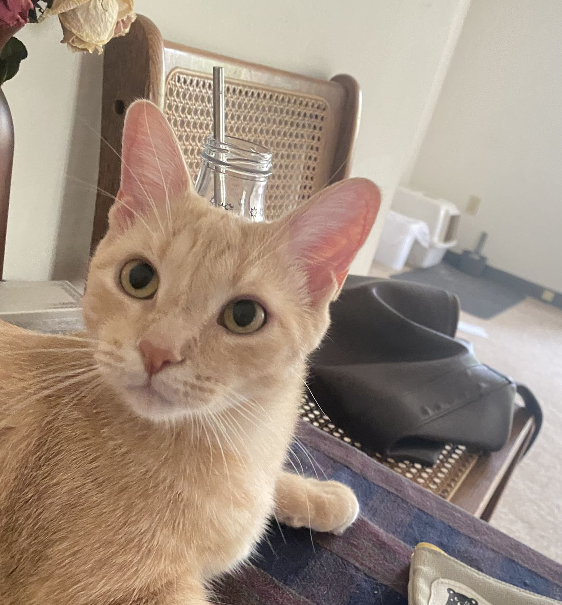

```{r setup, include=FALSE}
knitr::opts_chunk$set(echo = TRUE)
```

<br>

## Jingzhi Zhang

<br>
Collaborator: Tongxin Wang, Xingtan Yu
<br>

Link to my Github Page: https://github.com/jingzhi714

## kitty




